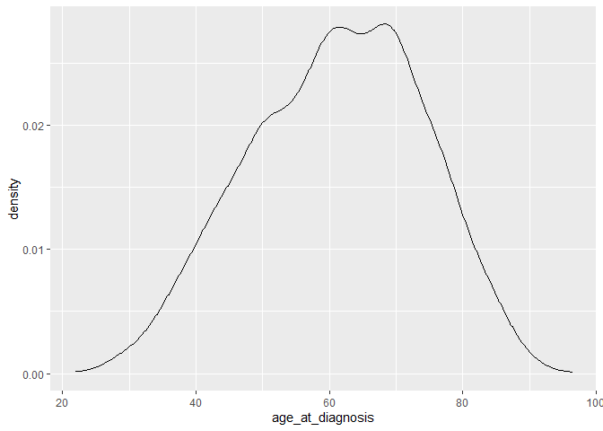
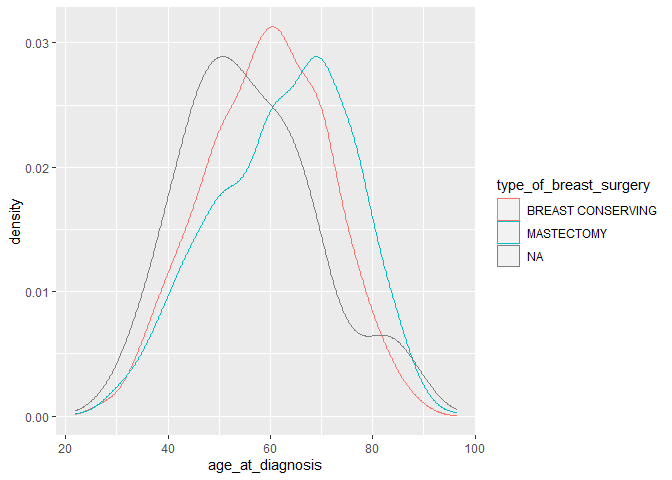
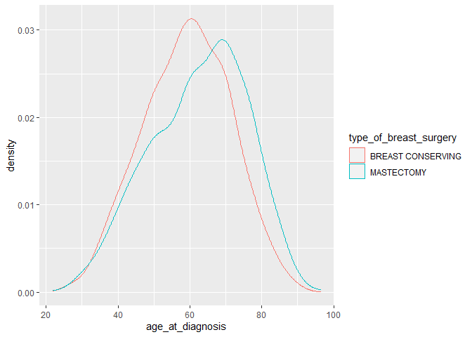

# Zusätzliche Funktionalität laden

Fast jede Software hat Erweiterungen irgendeiner Art. Die Bezeichnungen
variieren von extensions über plug-ins bis zur library. Unterschiedliche
Terminologie für dasselbe Prinzip: Mehr Features durch Erweiterungen,
die andere Leute bereitstellen. <!--more--> R hat sowas natürlich auch, als populäre
open-source Software. Hier heißen die Erweiterungen packages und
bestehen aus Funktionen, die andere Leute für bestimmte Anwendungsfälle
geschrieben haben. Durch ein zentrales Verteilungssystem werden die
Erweiterungen verfügbar gemacht, sodass wir alle sie benutzen können.
Das gute an R ist, egal was du dir ausdenkst oder brauchst, irgendwer
hat es schon gemacht und stellt es frei zur Verfügung. You name it.

Die Erweiterungen musst duzuerst mit dem Befehl
`install.packages("tidyverse")` installieren.

Mit dem Befehl `library` lädst du für jedes Projekt genau die
Funktionalität, die du brauchst.

``` r
library(tidyverse)
library(lubridate)
library(ggplot2)
library(ggpubr)
library(readxl)
library(khroma)
library(gtsummary)
library(survival)
library(survminer)
```

Am wichtigsten ist die Erweiterung ´tidyverse´. Das Tidyverse ist eine
Sammlung von Erweiterungen für die Statistiksoftware R, die von Hadley
Wickham und seinem Team eingeführt wurden und „eine zugrunde liegende
Designphilosophie, Grammatik und Datenstrukturen“ teilen.

# Data Wrangling

Data Wrangling, auch Datenaufbereitung genannt, bezeichnet den Prozess
der Strukturierung, Bereinigung und Transformation der Rohdaten in ein
Format, das sich inhaltlich auswerten und zur Modellierung sowie
Visualisierung einsetzen lässt. Die Datenaufbereitung ist essenziell und
erfordert ca. 50-80% der Zeit für eine Datenanalyse. In der Regel liegen
die Rohdaten in einer Excel-Tabelle oder als CSV-Datei vor (steht für
‚Comma-separated values‘ und beschreibt den Aufbau einer Textdatei zur
Speicherung einfach strukturierter Daten), die in einen R-Data Frame
(tibble) eingelesen werden. Für den Kurs wird der öffentlich zugängliche
Datensatz des Breast Cancer International Consortiums (METABRIC)
verwendet. Diese Datenbank eines kanadisch-britischen Projekts enthält
klinische und Sequenzierungsdaten von 1904 Patientinnen mit Brustkrebs.
Der Datensatz wurde von Professor Carlos Caldas vom Cambridge Research
Institute und Professor Sam Aparicio vom British Columbia Cancer Centre
in Kanada gesammelt und in Nature Communications veröffentlicht. Danach
werden die Daten bereinigt, so dass jede Spalte einer Variable und jede
Zeile einer Beobachtung entspricht. Der METABRIC Datensatz ist bereits
bereinigt und kann einfach eingelesen werden:

``` r
metabric <- read_csv("../METABRIC_RNA_Mutation.csv")
```

Sobald die Daten bereinigt sind, ist ein üblicher erster Schritt, sie zu
transformieren. Die Transformation umfasst die Eingrenzung von
Beobachtungen, die von Interesse sind (z.B. alle Patientinnen, die eine
Mastektomie erhalten haben), die Erstellung neuer Variablen, die
Funktionen vorhandener Variablen sind (z.B. die Berechnung des Alters
bei Therapiebeginn aus dem Geburtsdatum und dem OP-Datum), und die
Berechnung einer Reihe von zusammenfassenden Statistiken (z.B. Zählungen
oder Mittelwerte). Gerade Zählungen geben wichtige Rückschlüsse auf die
Datenqualität. Wenn alle Patientinnen beispielsweise sehr alt sind, ist
der Datensatz bezüglich des Alters unbalanciert. Auswertungen für Junge
Patientinnen können dann nicht durchgeführt werden. Das Bereinigen und
Transformieren der Daten wird als „Wrangling“ bezeichnet, weil es sich
oft wie ein Kampf anfühlt, die Daten in eine Form zu bringen, mit der
man gut arbeiten kann.

# Visualisierung

Besser noch als Zählen ist eine Visualisierung. Ein Bild sagt mehr als
1000 Worte. Unter Datenvisualisierung versteht man die Übertragung von
Informationen in einen visuellen Kontext, z.B. eine Karte oder ein
Diagramm, um Daten für das menschliche Gehirn leichter verständlich zu
machen und Erkenntnisse daraus zu ziehen. Das Hauptziel der
Datenvisualisierung besteht darin, Muster, Trends und Ausreißer in
Datensätzen zu erkennen. Eine gute Visualisierung kann unerwartete
Aspekte zeigen und neue Fragen zu den Daten aufwerfen. Eine gute
Visualisierung kann auch darauf hinweisen, dass die falsche Frage
gestellt wurde, oder dass andere Daten erhoben werden müssen.  
Das Statisitk-System R verfügt über mehrere Systeme zur Erstellung von
Diagrammen, aber ggplot2 ist eines der elegantesten und vielseitigsten.
ggplot2 implementiert die „Grammatik der Grafik“, ein kohärentes System
zur Beschreibung und Erstellung von Diagrammen. Die Funktionen im
ggplot2-Paket bauen ein Diagramm in Ebenen auf. Ein komplexes Diagramm
entsteht, indem mit einem einfachen Diagramm begonnen wird und nach und
nach zusätzliche Elemente (Ebenen) hinzugefügt werden. Um ein Diagramm
zu erstellen, teilen wir `ggplot` mit, dass unsere Daten `metabric`
sind, und geben an, dass die x-Achse die Variable `age_at_diagnosis`
darstellt. Dann weisen wir `ggplot` an, dies als Dichteplot
darzustellen, indem wir die Option `geom_density()` hinzufügen.

``` r
p <- ggplot(metabric, aes(x=age_at_diagnosis)) + geom_density()
p
```



Man sieht eine annähernde Normalverteilung des Patientenalters, und das
mit nur einer Zeile!

Geometrische Objekte oder `geoms` sind die eigentlichen Markierungen,
die wir auf einer Fläche anbringen. Beispiele hierfür sind:

Punkte (`geom_point`, für Streudiagramme, Punktdiagramme, usw.) Linien
(`geom_line`, für Zeitreihen, Trendlinien, usw.) Boxplot
(`geom_boxplot`, für, nun ja, Boxplots!)

Ein Diagramm sollte mindestens ein `geom` haben, aber es gibt keine
Obergrenze. Mit dem Operator + kannst Du ein `geom` zu einem Plot
hinzufügen. In `ggplot2` bedeutet ästhetisch “etwas, das man sehen
kann”. Jede Ästhetik `aes` ist eine Zuordnung zwischen einem visuellen
Merkmal und einer Variablen. Beispiele sind:

Position (d. h. auf der x- und y-Achse) Farbe (“äußere” Farbe) Füllung
(“innere” Farbe) Form (der Punkte) Linientyp Größe

Nun können wir einfach eine Ästhetik zu unserer Visualisierung
hinzufügen. Farblich können wir die chirurgische Therapie darstellen.

``` r
p <- ggplot(metabric, aes(x=age_at_diagnosis, color=type_of_breast_surgery)) + geom_density()
p
```



Tatsächlich ist der Datensatz bezüglich der chirurgischen Therapie
unvollständig. Bei einigen Patientinnen ist die Therapie nicht angegeben
oder sie haben vielleicht keine erhalten. Wir wissen das nicht. Wir
können aber zählen wie vollständig der Datensatz ist:

``` r
metabric %>% count(type_of_breast_surgery)
```

    # A tibble: 3 x 2
      type_of_breast_surgery     n
      <chr>                  <int>
    1 BREAST CONSERVING        755
    2 MASTECTOMY              1127
    3 <NA>                      22

Für nur 22 Fälle ist die chirurgische Therapie nicht bekannt, das ist
wirklich gut. In der Grafik hätten wir das nicht so leicht ablesen
können. Zählen lohnt sich als immer mal wieder.

Hier ist `%>%` der sogenannte “Pipe”-Operator. Dieser Operator leitet
einen Wert oder das Ergebnis eines Ausdrucks an den nächsten
Funktionsaufruf/Ausdruck weiter. Eine Funktion zum Filtern von Daten
kann zum Beispiel wie folgt geschrieben werden:

`filter(daten, variable == 42)`

oder

`daten %>% filter(variable == 42)`

Beide Funktionen erfüllen die gleiche Aufgabe, und der Vorteil der
Verwendung von `%>%` ist vielleicht nicht sofort ersichtlich; wenn Du
jedoch mehrere Funktionen ausführen möchtest, wird der Vorteil
offensichtlich.

Für eine Dissertation benötigen wir noch schöne Tabellen aus der
fantastischen library `gtsummary`.

``` r
tbl_summary(metabric %>% select(type_of_breast_surgery))
```


Jetzt entfernen wir die ungültigen Werte

``` r
 df <- metabric %>% drop_na(type_of_breast_surgery)
 df %>% count(type_of_breast_surgery)
```

    # A tibble: 2 x 2
      type_of_breast_surgery     n
      <chr>                  <int>
    1 BREAST CONSERVING        755
    2 MASTECTOMY              1127

und visualisieren den Datensatz erneut:

``` r
p <- ggplot(df, aes(x=age_at_diagnosis, color=type_of_breast_surgery)) + geom_density()
p
```



Patientinnen, die eine Matektomie erhalten haben, sind offensichtlich
älter.