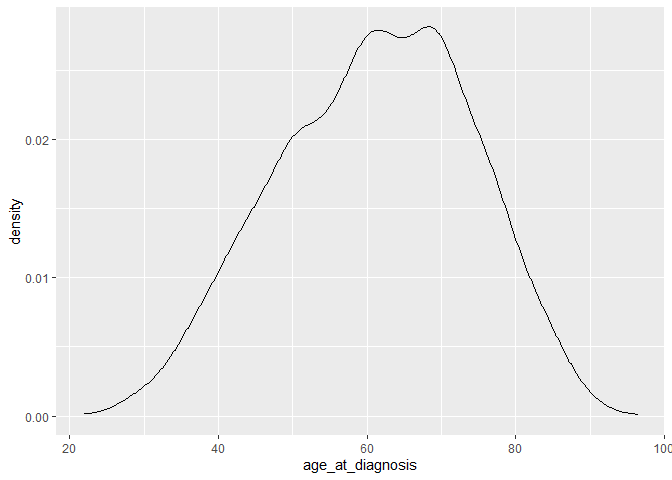
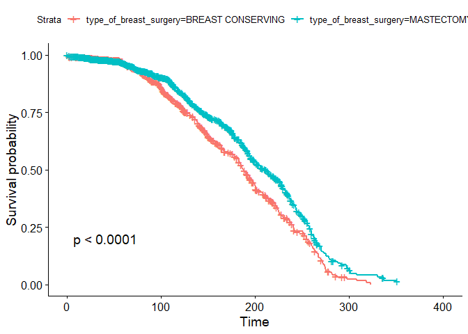
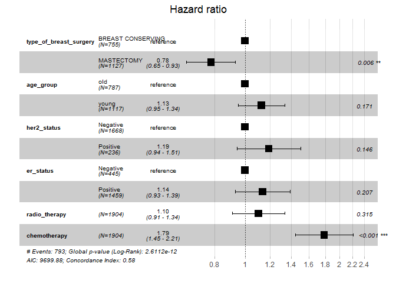

<script id="MathJax-script" async src="https://cdn.jsdelivr.net/npm/mathjax@3/es5/tex-mml-chtml.js"></script>

Sobald bereinigte Daten vorliegen, gibt es zwei Hauptmotoren der
Wissensgenerierung: Visualisierung und Modellierung. Beide haben
komplementäre Stärken und Schwächen, so dass bei einer Analyse immer
wieder zwischen ihnen gewechselt wird. Modelle sind ergänzende
Instrumente zur Visualisierung. Wenn die wissenschaftliche Fragestellung
hinreichend genau formuliert ist, kann sie mit Hilfe eines Modells
beantwortet werden. Daten aus klinischen Studien enthalten in der Regel
Überlebensdaten, die eine Überlebensanalyse erfordern. Bei dieser Art
von Analyse ist die Zeit bis zu einem bestimmten Ereignis, z.B. Tod oder
Wiederauftreten der Krankheit, von Interesse, und zwei (oder mehr)
Gruppen von Patienten werden in Bezug auf diese Zeit verglichen. <!--more-->

# Überlebensanalyse: Die Statistik

Bevor wir uns näher mit den Statistiken befassen, wollen wir uns mit
einigen nützlichen Begriffen vertraut machen: Der Begriff “Zensierung”
bezieht sich auf unvollständige Daten. Bei einigen Patient*innen wissen
wir vielleicht, dass sie oder er eine bestimmte Zeit lang verfolgt
wurde, ohne dass ein “Ereignis” eingetreten ist, aber wir wissen
vielleicht nicht, ob die Patient*in letztendlich überlebt hat oder
nicht. Dies kann der Fall sein, wenn die Patient\*in entweder bei der
Nachbeobachtung verloren ging oder sich aus der Studie zurückzog. Die
Daten dieses speziellen Patienten werden nach dem letzten Zeitpunkt
zensiert, an dem wir sicher wissen, dass bei Ihrem Patienten das
gesuchte Ereignis” nicht eingetreten ist. Ein Ereignis ist der vorab
festgelegte Endpunkt Ihrer Studie, z. B. Tod oder Wiederauftreten der
Krankheit. Außerdem werden alle Patienten, bei denen das “Ereignis” bis
zum Ende der Studie nicht eingetreten ist, zu diesem letzten Zeitpunkt
zensiert. Bedenke, dass es sich bei allen Zensierungstypen um Fälle von
Nichtinformation handelt und die Zensierung niemals durch das “Ereignis”
verursacht wird, das den Endpunkt der Studie definiert. Der METABRIC
Datensatz enthält Überlebensdaten. In der Spalte `overall_suvival_month`
ist das Überleben in Monaten angegeben. In der Spalte `overall_suvival`
ist vermerkt, ob der Fall den Endpunkt erreicht hat oder nicht (durch
Eingabe des Codes 1) oder ob der Zeitpunkt zensiert ist, d. h. der
Ausgang unbekannt ist (durch Eingabe des Codes 0). Diese Spalte enthält
also die Zensierung der Daten, das Ereignis ist Tod (Code 1).

# Kaplan-Meier-Methode und Log-Rank-Test

Wie sieht nun eine Überlebensfunktion aus, die das Überleben eines
Patienten im Zeitverlauf beschreibt? Der Kaplan-Meier-Schätzer, der
unabhängig voneinander von Edward Kaplan und Paul Meier beschrieben und
1958 gemeinsam im Journal of the American Statistical Association
veröffentlicht wurde, ist eine nicht-parametrische Statistik, mit der
wir die Überlebensfunktion schätzen können. Es sei daran erinnert, dass
eine nicht-parametrische Statistik nicht auf der Annahme einer
zugrundeliegenden Wahrscheinlichkeitsverteilung beruht.

Diese Statistik gibt die Wahrscheinlichkeit an, dass ein einzelner
Patient nach einem bestimmten Zeitpunkt $t$ überlebt. Bei $t = 0$ ist
der Kaplan-Meier-Schätzer 1, und wenn $t$ gegen unendlich geht, geht der
Schätzer gegen 0.

Der Kaplan-Meier-Schätzer beruht ferner auf der Annahme, dass die
Wahrscheinlichkeit, einen bestimmten Zeitpunkt $t$ zu überleben, gleich
dem Produkt der beobachteten Überlebensraten bis zum Zeitpunkt $t$ ist.
Genauer gesagt ist $S(t)$, die Überlebenswahrscheinlichkeit zum
Zeitpunkt $t$ gegeben durch $S(t) = p_1 \cdot p_2 \cdots p_t$, wobei
$p_1$ der Anteil aller Patienten ist, die den ersten Zeitpunkt
überleben, $p_2$ der Anteil der Patienten, die den zweiten Zeitpunkt
überleben, und so weiter, bis der Zeitpunkt $t$ erreicht ist. Dabei ist
zu beachten, dass ab $p_2$ bis $p_t$ bei der Berechnung der Anteile für
jeden weiteren Zeitpunkt nur die Patienten berücksichtigt werden, die
den vorherigen Zeitpunkt überlebt haben; $p_2, p_3, ..., p_t$ sind also
Anteile, die von den vorherigen Anteilen abhängig sind.

In der Praxis ist es sinnvoll, die Überlebenszeiten in der Reihenfolge
der zunehmenden Dauer zu ordnen. Dies schließt die zensierten Werte ein.
Anschließend werden die Anteile wie oben beschrieben berechnet und
aufsummiert, um $S(t)$ zu erhalten. Die zensierten Patienten werden nach
dem Zensurzeitpunkt weggelassen, so dass sie den Anteil der überlebenden
Patienten nicht beeinflussen. Ausführliche Informationen zu dieser
Methode findest Du in (Swinscow und Campbell, 2002).

Wir können den Log-Rank-Test verwenden, um die Überlebenskurven zweier
Gruppen zu vergleichen. Der Log-Rank-Test ist ein statistischer
Hypothesentest, der die Nullhypothese prüft, dass sich die
Überlebenskurven zweier Populationen nicht unterscheiden. Dabei wird der
$p$-Wert berechnet. Er wird bei statistischen Hypothesentests verwendet,
um die statistische Signifikanz zu quantifizieren. Ein Ergebnis mit
$p < 0,05$ wird normalerweise als signifikant angesehen. In unserem Fall
würde $p < 0,05$ bedeuten, dass die beiden Behandlungsgruppen in Bezug
auf das Überleben signifikant unterschiedlich sind.

# Cox-Proportional-Hazards-Modelle

Eine weitere nützliche Funktion im Zusammenhang mit Überlebensanalysen
ist die Hazard-Funktion $h(t)$. Sie beschreibt die Wahrscheinlichkeit
eines Ereignisses oder dessen Hazard $h$ (in diesem Fall das Überleben),
wenn die Person bis zu diesem bestimmten Zeitpunkt t überlebt hat. Sie
ist etwas schwieriger zu veranschaulichen als der Kaplan-Meier-Schätzer,
da sie das momentane Todesrisiko misst. Dennoch benötigen wir die
Hazard-Funktion, um Kovariaten zu berücksichtigen, wenn wir das
Überleben von Patientengruppen vergleichen. Kovariate, die in der
Regressionsanalyse auch als erklärende oder unabhängige Variablen
bezeichnet werden, sind Variablen, die möglicherweise mit der
untersuchten Variable in Zusammenhang stehen und dadurch das Ergebnis
verzerren.

Der Log-Rank-Test vergleicht zwei Kaplan-Meier-Überlebenskurven, die aus
der Aufteilung einer Patientenpopulation in Behandlungsgruppen
abgeleitet werden (z.B. Therapie A / Therapie B).
Cox-Proportional-Hazards-Modelle werden aus den zugrundeliegenden
Baseline-Hazard-Funktionen der betreffenden Patientenpopulationen und
einer beliebigen Anzahl dichotomisierter Kovariaten abgeleitet.
Dichotome Kovariaten sind Variablen mit zwei Merkmalsausprägungen, z.B.
Geschlecht. Auch hier wird nicht von einer zugrundeliegenden
Wahrscheinlichkeitsverteilung ausgegangen, sondern von der Annahme, dass
die Gefährdungen der zu vergleichenden Patientengruppen im Zeitverlauf
konstant sind. Aus diesem Grund wird es als “proportionales
Risikomodell” bezeichnet. Wir werden uns später ein Beispiel ansehen,
das diese theoretischen Überlegungen veranschaulicht.

Versuchen wir nun, den METABRIC Datensatz zu analysieren!

# Implementierung einer Überlebensanalyse in R

Mit diesen Konzepten in der Hand können wir nun mit der Analyse des
METABRIC Datensatzes beginnen und versuchen, einige der oben gestellten
Fragen zu beantworten. Beginnen wir wieder mit dem Laden der Pakete, die
für die Analysen benötigt werden.

``` r
library(tidyverse)
library(ggplot2)
library(readxl)
library(gtsummary)
library(survival)
library(survminer)
```

Der nächste Schritt besteht darin, den Datensatz zu laden und seine
Struktur zu untersuchen. Der METABRIC Datensatz umfasst eine Kohorte von
Brustkrebskrebspatientinnen und die entsprechenden klinischen
Informationen, einschließlich der Zeit, in der die Patientinnen
nachverfolgt wurden, bis sie entweder starben oder zur Nachverfolgung
verloren gingen (`overall_suvival_months`), ob die Patientinnen zensiert
wurden oder nicht (`overall_suvival`).

``` r
metabric <- read_csv("../METABRIC_RNA_Mutation.csv")
```

Die Spalte `overall_suvival_months` enthält die Überlebenszeiten. Dies
ist die Antwortvariable. `overall_suvival` hingegen gibt an, ob die
Überlebenszeit eines einzelnen Patienten zensiert ist. Die Patientinnen
in dieser Studie erhielten eine von zwei chirurgischen Therapien
(`type_of_breast_surgery`).

Darüber hinaus erhalten wir Informationen über das Alter der
Patientinnen, und wenn wir dieses als prädiktive Variable einbeziehen
wollen, müssen wir diese kontinuierliche Variable in binäre Werte
dichotomisieren. Aber welchen Cutoff sollte man dafür wählen? Schauen
wir uns die Gesamtverteilung der Alterswerte an.

``` r
p <- ggplot(metabric, aes(x=age_at_diagnosis)) + geom_density()
p
```



Es scheint eine bimodale Verteilung zwischen 60 und 70 Jahren
vorzuliegen, was einen Grenzwert von 65 Jahren nahelegt. Wir können die
Funktion `mutate` verwenden, um eine zusätzliche Spalte `age_group`
hinzuzufügen, die sich später als nützlich erweisen wird. Außerdem
konvertieren wir diese zukünftige kovariate Variable in einen Faktor, um
eine kategoriale Variable zu definieren.

``` r
metabric <- metabric %>% mutate(age_group = ifelse(age_at_diagnosis >=65, "old", "young"))
metabric$age_group <- factor(metabric$age_group)
```

Nun sind wir bereit, ein Survival-Objekt zu erstellen. Dabei handelt es
sich im Grunde um eine komprimierte Version der Spalten
`overall_suvival_months` und `overall_suvival`, die von der Funktion
`survfit` interpretiert werden kann. Das Überlebensobjekt, kann man sich
als eine Matrix vorstellen, mit einer Zeile für jeden Fall, wobei die
erste Spalte die letzte Nachverfolgungszeit darstellt und die zweite
angibt, ob es sich um eine zensierte Beobachtung handelt. Die weiteren
Funktionen für die Überlebensanalyse in R erwarten ein solches
Surv-Objekt. Damit kann man eine Überlebenskurve für zensierte Daten
unter Verwendung der Kaplan-Meier-Methode berechnen.

``` r
survObject <- Surv(time = metabric$overall_survival_months, event = metabric$overall_survival)
```

Der nächste Schritt ist die Anpassung der Kaplan-Meier-Kurven. Wir
können dies ganz einfach tun, indem wir das Objekt `surv_object` an die
Funktion `survfit` übergeben. Wir können die Kurve auch nach dem
Behandlungsschema `type_of_breast_surgery` stratifizieren, dem die
Patientinnen zugewiesen wurden.

``` r
fit <- survfit(survObject ~ type_of_breast_surgery, data = metabric)
```

Wir können die entsprechende Überlebenskurve untersuchen, indem wir das
Überlebensobjekt an die Funktion `ggsurvplot` übergeben. Das Argument
`pval = TRUE` ist sehr nützlich, da es auch den p-Wert des
Log-Rank-Tests aufzeichnet!

``` r
ggsurvplot(fit, data = metabric, pval = TRUE)
```



Der Log-Rank p-Wert von \< 0.0001 bedeutet ein signifikantes Ergebnis.

Aber ist das ein kausaler Zusammenhang? Waren die Patientinnen, die eine
brusterhaltende Therapie bekommen haben, vielleicht besonders alt oder
hatten Komorbiditäten, die eine radikale Therapie nicht erlaubten?
Hatten die länger überlebenden Patientinnen ein anderes Tumorstadium?
Kurzum, gibt es Kovariaten, die das Ergebnis verzerren? Wie wir in den
vorangegangenen Abschnitten gesehen haben, erlauben
Cox-Proportionale-Hazards-Modelle die Einbeziehung von Kovariaten. Wir
können Cox-Proportionale-Hazards-Modelle mit der Funktion `coxph`
erstellen und sie mit `ggforest` visualisieren. Diese Art der
Darstellung wird Forest Plot genannt. Er zeigt die so genannte Hazard
Ratios ($HR$), die aus dem Modell für alle dichotomen Kovariaten
abgeleitet werden, die wir in die Formel in `coxph` aufgenommen haben.
Kurz gesagt, eine $HR > 1$ zeigt ein erhöhtes Sterberisiko (gemäß der
Definition von $h(t)$) an, wenn eine bestimmte Bedingung bei einem
Patienten erfüllt ist. Ein $HR < 1$ bedeutet dagegen ein verringertes
Risiko. Schauen wir uns nun die Ergebnisse des Modells an.

``` r
# Fit a Cox proportional hazards model
fit.coxph <- coxph(survObject ~ type_of_breast_surgery + age_group +  her2_status + er_status + radio_therapy + chemotherapy, data = metabric)
ggforest(fit.coxph, data = metabric)
```



Bis auf die Gabe der Chemotherapie gibt es keine signifikanten
Kovariaten. Eine Chemotherapie ist bei $HR > 1$ mit einem erhöhten
Sterberisiko verbunden. Jetzt stellt sich die Frage, ob die
Chemotherapie mit der Operationsart zusammenhängt. Schauen wir uns
hierzu eine Tabelle an.

``` r
trial2 <- metabric %>% select(type_of_breast_surgery, chemotherapy)

tbl_summary(
    trial2,
    by = type_of_breast_surgery, # split table by group
    missing = "no" # don't list missing data separately
  ) %>%
  add_p() %>% # test for a difference between groups
  modify_header(label = "**Variable**") %>% # update the column header
  bold_labels() 
```


xx

Nur wenige Patientinnen erhalten eine Chemotherapie `136 + 252 = 388`.
Patientinnen mit Mastektomie erhalten signifikant häufiger eine
Chemotherapie. Da die Chemotherapie mit einem schlechteren Überleben
assoziiert ist (wahrscheinlich weil der Tumor weiter fortgeschritten
ist) und mehr Patientinnen mit Mestektomie eine Chemotherapie erhalten
haben, steht der positive Effekt der Mastektomie eher nicht mit der
Chemotherapie in kausalem Zusammenhang.